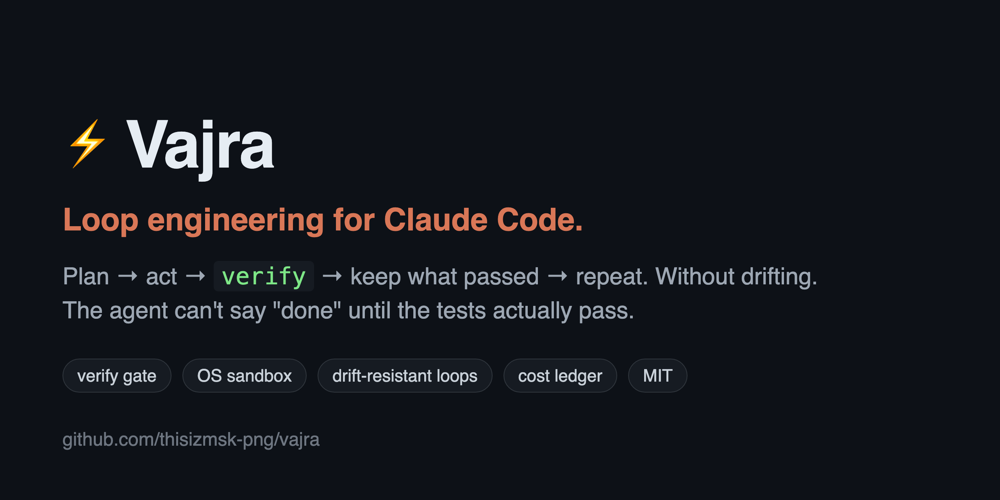
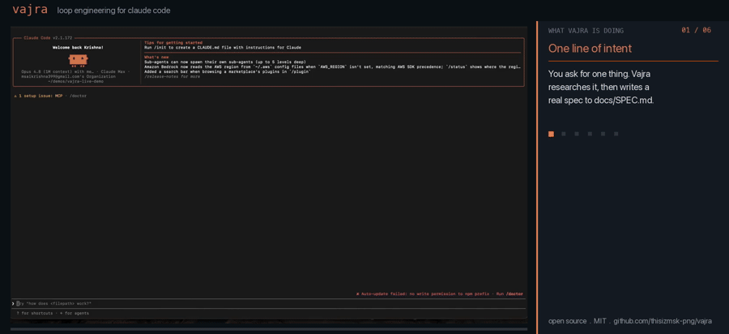
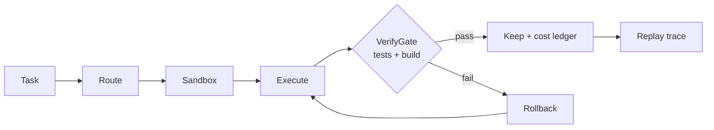

<div align="center">



### Turn Claude Code into a harness you can run unattended.

Every run is verify-gated (done means the tests passed), OS-sandboxed, and replayable, with a per-run cost ledger. Not another skill pack. A harness that verifies its own work.

[](LICENSE)
[](https://docs.claude.com/en/docs/claude-code)
[](#install-in-30-seconds)
[](SECURITY.md)
[](https://github.com/thisizmsk-png/vajra)


<br>
<sub><i>One real Claude Code session, sped up: a spec, a plan you trim, code, the tests proven green, the cost of the run, the replay trace, and a parallel fleet.</i></sub>

</div>

---

## What you get on every run

<div align="center">

**VerifyGate: done = tests passed** · OS-sandboxed (Seatbelt / bubblewrap) · replayable runs · per-run cost ledger · red-teamed x5 · 17-agent fleet · 87 skills

</div>

VerifyGate is the point. It runs your tests and build, captures the real output, and refuses to call a run done until they pass. Checks fail, the run is not done, and in CI it exits non-zero so a broken agent change cannot merge. Everything else (the routing, the sandbox, the ledger, the replay trace, the fleet) exists to make that one line trustworthy.

```bash
/vajra verify-work my-change "npm test" "npm run build"
# exit 0      all checks passed, walkthrough captured
# non-zero    a check failed: loud, the pipeline stops
```

---

## The problem it solves

Claude Code is good right up until you have to trust it unattended. It says "done" when the tests never ran. It confidently edits the wrong files. On a long job it drifts off the plan and you do not notice for an hour. And it can run any shell command on your machine while you are not looking.

Vajra is the layer that makes a run something you can verify instead of hope about. This is loop engineering. Prompt engineering got one turn right, context engineering controlled what the model sees, and the loop itself is the next layer: plan, act, verify, keep what passed, repeat, without drifting.

---

## Install in 30 seconds

```bash
git clone https://github.com/thisizmsk-png/vajra.git ~/.claude/skills/vajra
bash ~/.claude/skills/vajra/scripts/install.sh
```

Start a Claude Code session and Vajra is active. Keep working the way you already do, and reach for a `/vajra` command when you want a plan, proof, a review, or a cost check. Type `/vajra help` anytime.

```bash
# turn on the real security boundary (do not skip this for unattended runs)
bash ~/.claude/skills/vajra/scripts/enable-sandbox.sh

# optional: add the 87 bundled skills and 17 specialized agents
bash ~/.claude/skills/vajra/scripts/install-skills.sh
```

**Needs:** Claude Code CLI · Git · Node.js 18+ · macOS or Linux/WSL2.

> ⭐ If Vajra catches one bad agent run for you, [star it](https://github.com/thisizmsk-png/vajra). That is how other people find it.

---

## How a run works

Every task goes through the same path, and each step leaves a record.



1. **Route.** Input passes a 4-tier cascade, stopping at the first match: regex (0 tokens), active-campaign resume (0), keyword lookup (0), then LLM classification (about 500 tokens, only when nothing cheaper matched). A self-improvement loop ("Atman") learns shortcuts, so more tasks route for free over time.
2. **Sandbox.** Work runs inside an OS sandbox (Seatbelt on macOS, bubblewrap on Linux) that enforces which files and network a command can touch at the OS level, not by hoping the model behaves. A hardened pre-tool hook also blocks dangerous commands and stops the agent from rewriting its own guardrails.
3. **Execute.** The agent does the work, checkpointing to git as it goes.
4. **VerifyGate.** Your build and tests run for real, and the output is captured into a walkthrough. Pass, and the run is kept. Fail, and it is not done.
5. **Rollback on fail.** A failed gate rolls the change back to the last green checkpoint instead of shipping it.
6. **Cost ledger and replay trace.** Every kept run records what it cost (per model, with cache-hit-rate) and leaves a tamper-evident trace you can replay.

On long autonomous jobs the drift-resistant Ralph loop runs a fresh agent each iteration against a durable progress file, with a just-in-time repo map and compaction-with-git-checkpoint, so an overnight run keeps its plan.

---

## See what it cost. Replay what it did.

Two things most agent runs hide from you: the real cost, and a record you can replay. Both are real output, not mockups.


- **Cost ledger** (`/vajra cost`): per-model tokens, USD, and cache-hit-rate, the number that tells you whether you are spending efficiently.
- **Replay trace** (`/vajra replay`): every tool call logged to a tamper-evident record, so you can reconstruct exactly what the agent did, step by step.

Watch the whole loop on a real session, with a side panel narrating each beat: one line of intent, a spec, a plan you trim, act, VerifyGate going green, the cost ledger, the replay trace, and a parallel fleet.

▶︎ [docs/assets/vajra-build-explainer.mp4](docs/assets/vajra-build-explainer.mp4)

---

## Claude Code, with and without Vajra

Same agent underneath. The difference is what happens around the run.

| On a real codebase | Claude Code alone | + **Vajra** |
|---|---|---|
| "Done" means | the agent's word | the tests actually passed (VerifyGate) |
| A failing run | ships anyway | rolled back to the last green checkpoint |
| In CI | no gate | exits non-zero on a failed verify |
| Dangerous commands | "please be careful" | an OS sandbox enforces it |
| What a run cost | invisible | per-model ledger + cache-hit-rate |
| Reproduce a run | no record | a deterministic, replayable trace |
| A long autonomous run | drifts off-task | drift-resistant Ralph loop |
| Next session | memory is gone | campaigns persist (`/vajra continue`) |
| A hard job | one generalist | a parallel-worktree 17-agent fleet |

---

## Your first 10 minutes

Think in terms of what you want, not which command to memorize.

**Do a multi-step thing, but show me the plan first.**
```
/vajra plan "migrate the user table to PostgreSQL"
   explores read-only, writes data/plans/migrate-user-table.plan.md
   you open it, delete the step you do not want, save
/vajra act
   does exactly the remaining steps, checkpointing as it goes
```

**Prove the fix actually works.**
```
/vajra verify-work my-fix "npm test" "npm run build"
   runs both through VerifyGate, captures output and diff, fails loud if anything fails
```

**Review my changes properly.**
```
/vajra review
   BLOCKING vs advisory findings, each with the rule it breaks and the smallest fix
```

**Spin up a whole crew.**
```
/vajra fleet security-audit
   security, red-team, pentest, and QA, in parallel worktrees
```

**Run a long job overnight without it drifting.**
```
/vajra ralph progress.md
   a fresh agent each iteration against a durable progress file
```

---

## Everyday commands

| You want to | Command |
|---|---|
| Run a task (auto-routed to the right skill or agent) | `/vajra <task>` |
| Plan first, then execute the edited plan | `/vajra plan <task>` then `/vajra act` |
| Prove work is done through VerifyGate | `/vajra verify-work <name> "<cmd>"` |
| Review the current diff against the rules | `/vajra review` |
| See per-model cost and cache-hit-rate | `/vajra cost` |
| Replay what the agent did | `/vajra replay [session]` |
| Resume or inspect a multi-step job | `/vajra continue` · `/vajra status` |
| Run agents in parallel | `/vajra fleet <tasks>` |
| Security-test a skill or agent | `/vajra redteam <target>` |
| Long autonomous loop (drift-resistant) | `/vajra ralph <progress.md>` |
| Full reference | `/vajra help` |

The full 87-skill and 17-agent catalog lives in [`docs/`](docs/). Each agent and skill is one self-contained file.

---

## Is it safe? The honest version

Security is layered, and **[SECURITY.md](SECURITY.md)** has the full model. Short version:

- The **OS sandbox** (Seatbelt / bubblewrap) is the real boundary. It enforces file and network access at the OS level. **Turn it on** (`scripts/enable-sandbox.sh`).
- On top of that, a hardened hook blocks dangerous commands, stops the agent from rewriting its own guardrails, and blocks secret exfiltration. It has been through five rounds of red-teaming, with a regression test for every bypass found.
- Untrusted content (memory, web data) is wrapped and sanitized against prompt injection. Harness files are integrity-checked every session.

A command denylist cannot be a complete control by itself, which is exactly why the OS sandbox is the enforced boundary. Do not skip turning it on.

---

## What Vajra does not do (yet)

- **Claude Code only.** It does not wrap Cursor, Codex, or Gemini, and VerifyGate and the sandbox have not been validated against them.
- **The sandbox is opt-in.** Without `enable-sandbox.sh` you get the hook denylist but not the enforced OS boundary, and the denylist alone is not a complete control.
- **macOS and Linux/WSL2 only.** Native Windows is not supported.
- **VerifyGate is only as good as your tests.** It proves your checks passed, not that your checks are sufficient. It does not write your test suite for you.
- **Young, solo-built project (about 1 star today).** There are no "used by" logos here, because there are none to claim. The proof is the gate, the sandbox, the red-team rounds, and the demos above.

---

## Under the hood

**Smart routing, most tasks cost zero extra tokens.** Every input passes the 4-tier cascade above, and the "Atman" self-improvement loop learns shortcuts so more tasks route for free over time.

**Campaigns persist** to SQLite with HMAC integrity and checkpoints, so `/vajra continue` resumes exactly where you left off, even in a new session. **Specialized agents** adopt the right persona for a task and enforce that domain's rules during review. **Context engineering for long runs** (a just-in-time repo map, compaction-with-git-checkpoint, and the drift-resistant Ralph loop) keeps long jobs from blowing the context window.

---

## Contributing

```bash
bash tests/run-all.sh   # the full suite (about 280 cases), green before you ship
```

New contributors: look for [`good first issue`](https://github.com/thisizmsk-png/vajra/issues?q=is%3Aissue+is%3Aopen+label%3A%22good+first+issue%22). Each agent and skill is a self-contained file, so adding one is small and well-scoped. See [CONTRIBUTING.md](CONTRIBUTING.md).

---

<div align="center">

**Vajra**, an agent harness for Claude Code. VerifyGate, OS sandbox, replayable runs, and a cost ledger in one layer. MIT.

</div>
