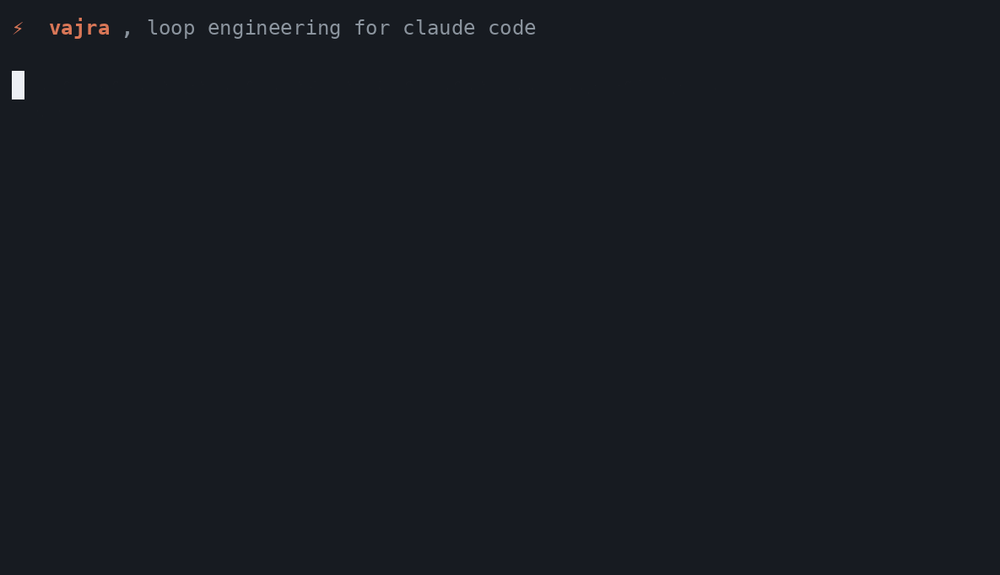

<div align="center">

# ⚡ Vajra

### Loop engineering for Claude Code.

Claude Code is great until you actually have to trust it. It says "done" when the tests never ran. It confidently edits the wrong files. On a long task it drifts off the plan and you don't catch it for an hour. **Vajra is the layer that fixes that**, it makes an agent run something you can *verify*, not just hope about: it plans before it acts, won't call work done until the tests pass, doesn't drift on long runs, and can't touch anything outside an OS sandbox.

[](LICENSE)
[](https://docs.claude.com/en/docs/claude-code)
[](#install-in-30-seconds)
[](SECURITY.md)
[](https://github.com/thisizmsk-png/vajra)

<!-- HERO GIF, record with vajra-demo.tape. Show plan → act → verify-gate catching a bad run. <5MB, above the fold. -->

<br>
<sub><i>Plan it · trim the plan · run only what you approved · prove the tests actually passed.</i></sub>

</div>

---

## Install in 30 seconds

```bash
git clone https://github.com/thisizmsk-png/vajra.git ~/.claude/skills/vajra
bash ~/.claude/skills/vajra/scripts/install.sh
```

Start a Claude Code session and Vajra is active. Keep using Claude Code the way you already do, reach for a `/vajra` command when you want a plan, a review, proof, or a cost check. Type `/vajra help` anytime.

```bash
# optional: add the 87 bundled skills + 17 specialized agents
bash ~/.claude/skills/vajra/scripts/install-skills.sh

# recommended: turn on the OS security boundary (this is the real one)
bash ~/.claude/skills/vajra/scripts/enable-sandbox.sh
```

**Needs:** Claude Code CLI · Git · Node.js 18+ · macOS or Linux/WSL2.

> ⭐ If Vajra saves you one bad agent run, [star it](https://github.com/thisizmsk-png/vajra), that's how other people find it.

---

## What's the idea: loop engineering

Prompt engineering was about getting one turn right. Context engineering was about controlling what the model sees. The next layer is the loop itself, **plan → act → verify → keep what passed → repeat, without drifting.** That's loop engineering, and Vajra is the loop layer for Claude Code.

Most Claude Code tools help you run *more* agents. Vajra helps you *trust* the ones you run. The verify gate, the OS sandbox, the cost ledger, the drift-resistant loop, those are the product, not an afterthought.

### Claude Code vs Claude Code + Vajra

| On a real codebase | Claude Code alone | + **Vajra** |
|---|---|---|
| "Done" means | the agent's word | the tests actually passed (verify gate) |
| Before it edits | it just goes | plan first, you trim the plan |
| Dangerous commands | "please be careful" | an OS sandbox enforces it |
| A long autonomous run | drifts off-task | drift-resistant Ralph loop |
| What it cost | invisible | per-model ledger + cache-hit-rate |
| Next session | memory is gone | campaigns persist (`/vajra continue`) |
| What happened | no record | tamper-evident, replayable trace |
| A hard job | one generalist | dispatch a 17-agent fleet |

Same agent underneath. Vajra adds the guardrails, proof, memory, and cost control that Claude Code leaves to you.

---

## See it in action

A 45-second tour of every feature (fleet, plan to act, verify gate, cost ledger, repo map, replay, sandbox, and more):


And watch the whole loop on a real session, with a side panel narrating each beat as it happens. One line of intent, a spec, a plan you trim, act, the verify gate going green, the cost ledger, the replay trace, and a parallel fleet:

▶︎ [vajra-build-explainer.mp4](docs/assets/vajra-build-explainer.mp4)

> GIFs embed inline anywhere. To embed an MP4 as an auto-playing player, drag it into the GitHub README editor.

---

## What you get

- 🛡️ **It won't wreck your machine or leak your secrets.** An OS sandbox (macOS Seatbelt / Linux bubblewrap) enforces which files and network a command can touch, at the OS level, not by hoping the model behaves. A hardened hook also blocks dangerous commands and stops the agent from rewriting its own guardrails.
- 📝 **It plans before it touches code.** Ask for a plan and it explores read-only, writes an editable plan file you can trim, then runs exactly what you approved. No more "it confidently did the wrong thing."
- ✅ **"Done" means proven, not claimed.** A verify gate runs your tests/build and captures the output into a walkthrough. Checks fail → it isn't done. This is the part I actually wanted.
- 🔍 **Real code review.** `/vajra review` checks your diff against a concrete rule set (security, testing, best practices) and reports only the few findings that matter, with the rule it breaks and the smallest fix.
- 💰 **You can see what it costs.** Per-model cost ledger with cache-hit-rate, the number that tells you if you're spending efficiently.
- 🧠 **It remembers across sessions.** Multi-step "campaigns" persist with integrity checks; `/vajra continue` picks up exactly where you left off, even in a new session.
- 👁️ **Every tool call is logged** to a tamper-evident, replayable trace, so you can reconstruct exactly what the agent did.
- 🤖 **A team when you need one.** 17 specialized agents (backend, frontend, security, QA, SRE…), each enforcing the rules for its domain. Run them in parallel with `/vajra fleet`.

---

## Your first 10 minutes

Think in terms of what you want, not which command to memorize.

**"Do this multi-step thing, but show me the plan first."**
```
/vajra plan "migrate the user table to PostgreSQL"
 → explores read-only, writes data/plans/migrate-user-table.plan.md
 → you open it, delete the step you don't want, save
/vajra act
 → does exactly the remaining steps, checkpointing as it goes
```

**"Review my changes properly."**
```
/vajra review
 → BLOCKING vs advisory findings, each with the rule it breaks and the smallest fix
```

**"Prove the fix actually works."**
```
/vajra verify-work my-fix "npm test" "npm run build"
 → runs both, captures output + diff into a walkthrough; fails loud if anything fails
```

**"What did this cost?"**
```
/vajra cost
 → per-model tokens + USD + cache-hit-rate
```

**"Spin up a whole crew."**
```
/vajra fleet security-audit → security + red-team + pentest + QA, in parallel
```

**"Run a long job overnight without it drifting."**
```
/vajra ralph progress.md → fresh agent each iteration, durable progress file
```

---

## Everyday commands

| You want to… | Command |
|---|---|
| Run a task (auto-routed to the right skill/agent) | `/vajra <task>` |
| Plan first, then execute the edited plan | `/vajra plan <task>` → `/vajra act` |
| Review the current diff against the rules | `/vajra review` |
| Prove work is done (run + capture checks) | `/vajra verify-work <name> "<cmd>"…` |
| See per-model cost + cache-hit-rate | `/vajra cost` |
| Replay/verify what the agent did | `/vajra replay [session]` |
| Resume / inspect a multi-step job | `/vajra continue` · `/vajra status` |
| Run agents in parallel | `/vajra fleet <tasks…>` |
| Security-test a skill or agent | `/vajra redteam <target>` |
| Long autonomous loop (drift-resistant) | `/vajra ralph <progress.md>` |
| Full reference | `/vajra help` |

---

## Is it safe? Yes, here's the honest version

Security is layered, and **[SECURITY.md](SECURITY.md)** has the full model. Short version:

- The **OS sandbox** (Seatbelt / bubblewrap) is the real boundary, it enforces file and network access at the OS level. **Turn it on** (`scripts/enable-sandbox.sh`).
- On top of that, a hardened hook blocks dangerous commands, stops the agent from rewriting its own guardrails, and blocks secret exfiltration. It's been through five rounds of red-teaming, with a regression test for every bypass found.
- Untrusted content (memory, web data) is wrapped and sanitized against prompt injection; harness files are integrity-checked every session.

I'm deliberately honest about the limits: a command denylist can't be a complete control by itself, which is exactly why the OS sandbox is the enforced boundary. Don't skip turning it on.

---

## How it works (under the hood)

**Smart routing, most tasks cost zero extra tokens.** Every input passes through a 4-tier cascade, stopping at the first match: regex (0 tokens) → active-campaign resume (0) → keyword lookup (0) → LLM classification (~500 tokens, only when needed). A self-improvement loop ("Atman") learns shortcuts so more tasks route for free over time.

**Campaigns persist** to SQLite with HMAC integrity + checkpoints, so `/vajra continue` resumes exactly where you left off. **Specialized agents** adopt the right persona for a task and enforce that domain's rules during review. **Context engineering for long runs**, a just-in-time repo map, compaction-with-git-checkpoint, and the drift-resistant Ralph loop, keeps long jobs from blowing the context window.

---

## Contributing

```bash
bash tests/run-all.sh # the full suite (~280 cases), everything green before you ship
```

New contributors: look for [`good first issue`](https://github.com/thisizmsk-png/vajra/issues?q=is%3Aissue+is%3Aopen+label%3A%22good+first+issue%22). Each agent and skill is a self-contained file, adding one is small and well-scoped.

---

<div align="center">

[](https://star-history.com/#thisizmsk-png/vajra&Date)

**Vajra**, loop engineering for Claude Code · an agent harness with safety, proof, memory, and cost control in one layer · MIT

</div>
