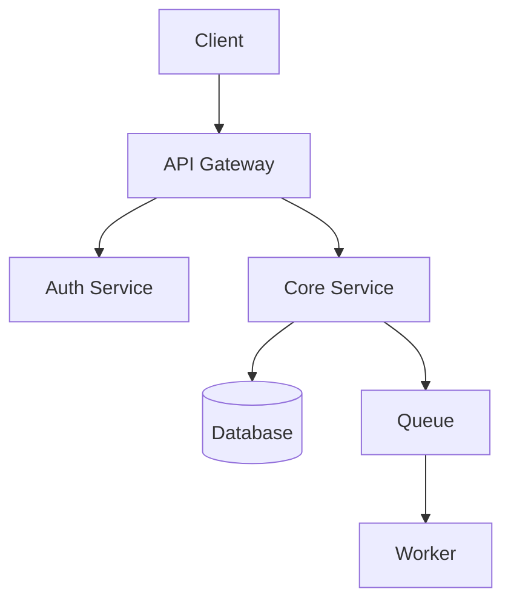
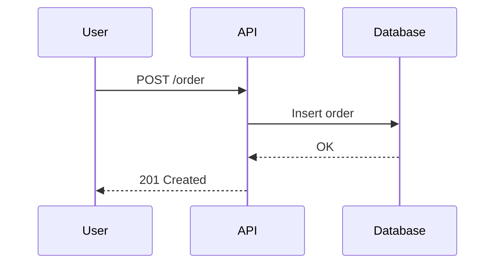

# Architecture Diagrams

## When to Activate
- User mentions: diagram, visualize, architecture diagram, flowchart, sequence diagram, ERD, data flow
- Documenting system architecture
- Explaining complex flows to stakeholders
- Designing before implementing

## Diagram Selection

| What to Show | Diagram Type | Tool |
|-------------|-------------|------|
| System components + connections | Component diagram | Mermaid `graph` |
| Request lifecycle | Sequence diagram | Mermaid `sequenceDiagram` |
| Data flow through pipeline | Flowchart | Mermaid `flowchart` |
| Database schema | ERD | Mermaid `erDiagram` |
| State transitions | State diagram | Mermaid `stateDiagram-v2` |
| Class relationships | Class diagram | Mermaid `classDiagram` |
| Timeline / Gantt | Timeline | Mermaid `gantt` |
| Quick sketch | ASCII art | In-line |

## Mermaid Patterns

### Component Diagram


### Sequence Diagram


### ERD
```mermaid
erDiagram
    USER ||--o{ ORDER : places
    ORDER ||--|{ ITEM : contains
    USER { string id PK; string email; string name }
    ORDER { string id PK; string user_id FK; float total }
```

## Design Principles
1. **One diagram, one question** — each diagram should answer exactly one question
2. **Isomorphism test** — would the structure communicate without labels?
3. **Depth assessment**: simple concepts → minimal; complex systems → detailed
4. **Max 12 nodes** per diagram — split if more
5. **Color coding**: use color to group related components, not for decoration
6. **Left-to-right** for flows, **top-to-bottom** for hierarchies

## Rendering
- **In docs**: Mermaid renders natively in GitHub, GitLab, Notion
- **In CLAUDE.md**: ASCII art (always works, no renderer needed)
- **For presentations**: Export Mermaid to SVG/PNG via `mmdc` CLI
- **Interactive**: Excalidraw for whiteboard-style diagrams

```bash
# Render Mermaid to PNG
npx -p @mermaid-js/mermaid-cli mmdc -i diagram.mmd -o diagram.png
```

## Guardrails
- ALWAYS label edges (arrows without labels are ambiguous)
- NEVER create a diagram without a title and date
- Keep diagrams close to the code they describe (same repo, linked from CLAUDE.md)
- Update diagrams when architecture changes (stale diagrams are worse than none)
